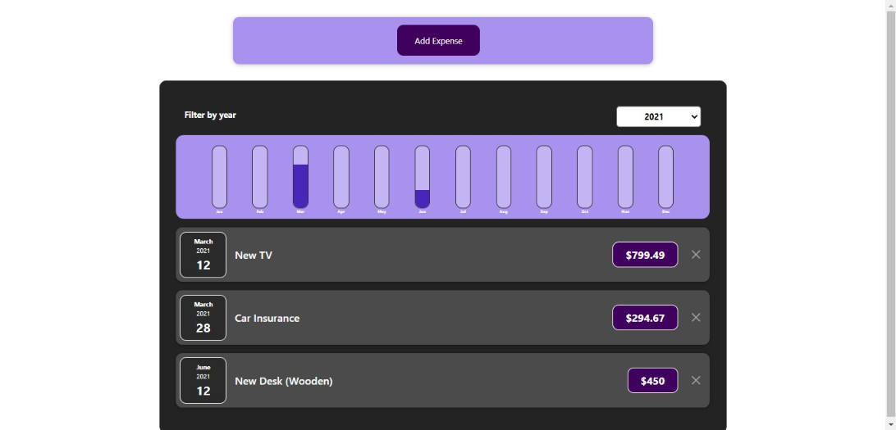
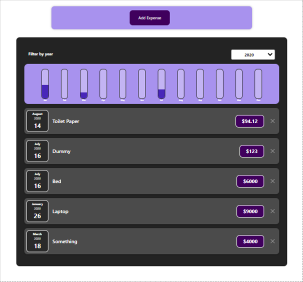
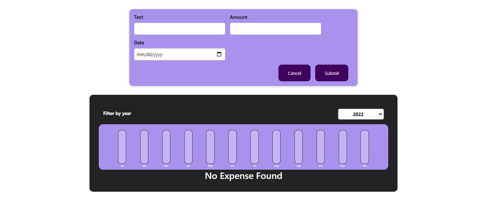

# React-Expense-Tracker
React Expense Tracker to track Expenses filtered by year with dynamic expense chart. 

**Technology Used**- ReactJs, HTML, CSS, Bootstrap 

**Steps Required** 
<ul>
<li>Download the code
<li>Download node.js from https://nodejs.org/en/
<li>Open terminal in root folder.
<li>Run npm install
<li>Run npm start
</ul>

<b>SCREENSHOTS</b>

